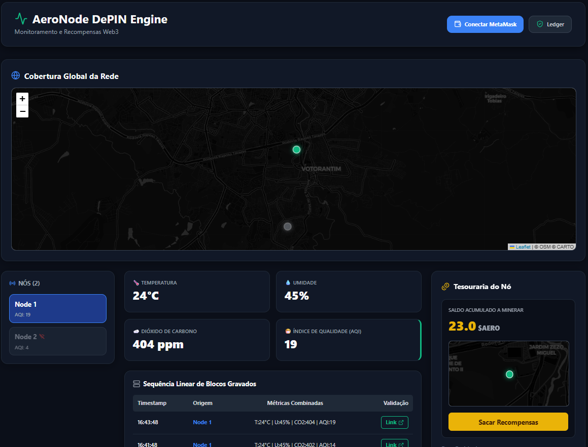
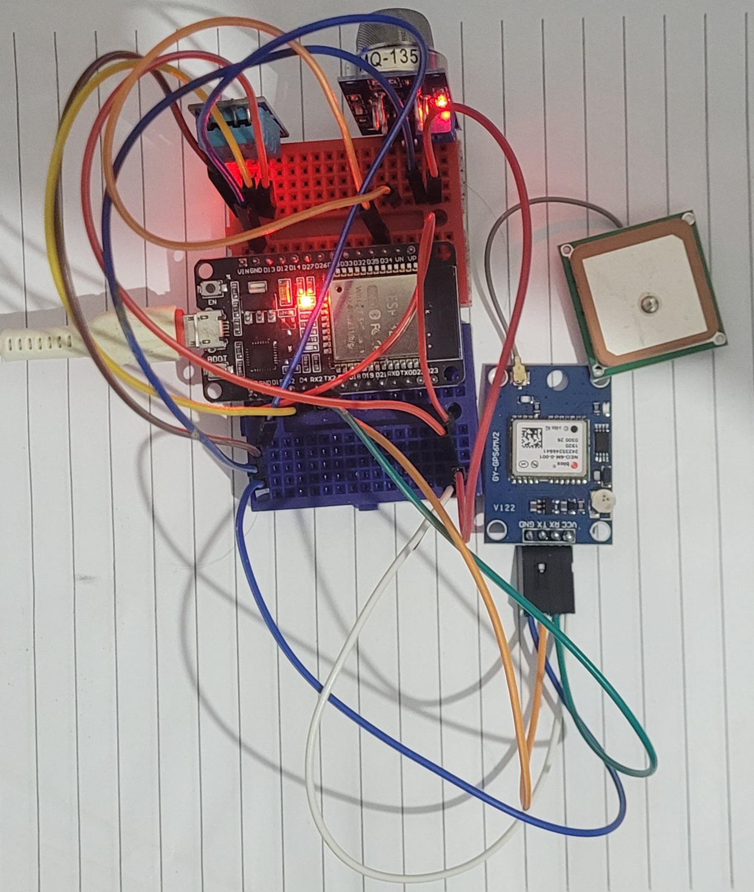

# 🌍 AeroNode DePIN

**Sistema de Monitoramento Ambiental Descentralizado com Incentivos Web3**

---

## 🚀 Sobre o Projeto

Este projeto foi desenvolvido para o **HackWeb**, uma atividade prática em formato de Hackathon que encerra a capacitação da **Residência em TIC29**. O objetivo desta etapa é permitir que os alunos da trilha Web3 coloquem em prática todas as habilidades arquitetônicas e de desenvolvimento aprendidas ao longo da formação.

O ecossistema foi projetado de ponta a ponta para demonstrar a viabilidade prática da integração de sistemas embarcados IoT de baixo custo com redes descentralizadas baseadas em EVM, aplicando conceitos reais de tokenomics, oráculos de middleware e contratos inteligentes.

---

## 🎯 Visão Geral

O AeroNode é uma infraestrutura **DePIN (Decentralized Physical Infrastructure Network)** construída para coletar, validar e registrar dados de qualidade do ar e telemetria climática em tempo real.

A solução integra hardware IoT baseado em ESP32, uma camada middleware responsável pela retransmissão segura dos dados e contratos inteligentes implantados na blockchain Ethereum.

Como incentivo à participação da rede, os operadores recebem recompensas em **$AERO**, um token ERC-20 criado especificamente para o ecossistema.

---

## 📸 Dashboard



---

# 📖 Resumo Executivo

O AeroNode é uma infraestrutura DePIN construída para coletar, validar e registrar dados ambientais em tempo real.

O sistema integra hardware de borda (**Edge Computing**) baseado em microcontroladores de baixo custo com a imutabilidade da blockchain Ethereum (Sepolia Testnet), recompensando os operadores dos nós de forma autônoma através do token utilitário **$AERO**.

Cada nó AeroNode utiliza um **ESP32** para realizar leituras da qualidade do ar a cada **1 minuto**.

Após cada leitura:

1. Os sensores coletam dados ambientais.
2. O ESP32 monta um pacote JSON.
3. Os dados são enviados ao servidor middleware.
4. O middleware registra a leitura na blockchain.
5. O contrato inteligente valida a operação.
6. O operador recebe **1 token $AERO** pela contribuição realizada.

Dessa forma, a rede cria um modelo sustentável de incentivo para expansão da infraestrutura de monitoramento ambiental descentralizada.

---

# 🎨 Design Industrial e Prototipagem 3D

O encapsulamento foi desenvolvido para:

* Proteger os componentes eletrônicos.
* Facilitar a circulação de ar no sensor MQ-135.
* Permitir futuras expansões de hardware.
* Possibilitar fabricação por impressão 3D.

Toda a modelagem foi desenvolvida utilizando Blender.


---

# 🔌 Hardware e Esquemático

## Protótipo



## Esquemático da Placa


## Placa de circuito impresso


### Componentes Utilizados

| Componente | Função                     |
| ---------- | -------------------------- |
| ESP32      | Microcontrolador principal |
| MQ-135     | Sensor de qualidade do ar  |
| DHT11      | Temperatura e umidade      |
| GPS NEO-6M | Geolocalização             |
| Fonte USB  | Alimentação                |

### Ligações

| Componente | ESP32     |
| ---------- | --------- |
| MQ135 (AO) | GPIO34    |
| DHT11      | GPIO4     |
| GPS TX     | GPIO16    |
| GPS RX     | GPIO17    |
| VCC        | 3.3V / 5V |
| GND        | GND       |

---

# 🏗️ Arquitetura do Sistema

A arquitetura é dividida em quatro camadas independentes.

## 1️⃣ Camada de Borda (Edge Node)

Responsável pela coleta dos dados ambientais.

### Hardware

* ESP32
* MQ-135
* DHT11
* GPS NEO-6M

### Funcionalidades

* Leitura periódica a cada minuto.
* Filtragem por oversampling.
* Geolocalização do dispositivo.
* Associação da carteira do operador.

### Segurança

A carteira pública do operador é embarcada no firmware.

Nenhuma chave privada é armazenada no dispositivo.

---

## 2️⃣ Camada Middleware (Relayer)

Responsável pela comunicação entre o ESP32 e a blockchain.

### Tecnologias

* Node.js
* Express
* Ethers.js

### Responsabilidades

* Receber requisições HTTP.
* Validar dados.
* Construir transações.
* Assinar transações.
* Pagar taxas de gás.

---

## 3️⃣ Camada Blockchain

Responsável pelo armazenamento imutável e tokenização.

### Rede

Ethereum Sepolia Testnet

### Linguagem

Solidity ^0.8.20

---

## 📜 Contrato AeroNodeV3.sol

Contrato principal da rede.

### Responsabilidades

* Registro das leituras ambientais.
* Controle de nós cadastrados.
* Controle de recompensas.
* Validação de cooldown.
* Integração com o token ERC-20.

### Funcionalidades

```solidity
registrarLeitura()
cadastrarNo()
sacarRecompensas()
consultarDados()
```

### Segurança

* Cooldown de 45 segundos.
* Prevenção de spam.
* Prevenção de ataques Sybil.

---

## 🪙 Contrato AeroToken.sol

Token ERC-20 do ecossistema.

### Características

* ERC-20
* OpenZeppelin
* Mint controlado
* Supply dinâmica

### Funcionalidades

```solidity
mint()
transfer()
approve()
balanceOf()
```

### Modelo Econômico

Cada leitura válida registrada:

```text
1 Leitura = 1 $AERO
```

---

## 🔗 Contratos Implantados

### AeroNodeV3

```text
0xD3C2641088b9d677ae8Daa90BaA23206440B7d1E
```

### Explorer

https://sepolia.etherscan.io/address/0xD3C2641088b9d677ae8Daa90BaA23206440B7d1E

---

# 4️⃣ Dashboard Web

Camada de visualização e interação com a rede.

## Tecnologias

* React
* Ethers.js
* React Leaflet
* Lucide React

## Funcionalidades

* Visualização dos sensores.
* Mapa em tempo real.
* Consulta dos registros.
* Integração MetaMask.
* Reivindicação de recompensas.
* Histórico blockchain.

---

# 📊 Fluxo de Dados

```text
MQ135 + DHT11
        │
        ▼
      ESP32
        │
        ▼
 Middleware Node.js
        │
        ▼
 Smart Contract
        │
        ▼
 Registro Blockchain
        │
        ▼
 Crédito de 1 $AERO
        │
        ▼
 Dashboard
        │
        ▼
 MetaMask
```

---

# 🪙 Tokenomics

## Recompensa

Cada leitura válida registrada gera:

```text
+1 $AERO
```

## Frequência

```text
1 leitura por minuto
```

## Produção Teórica

```text
1 minuto  = 1 $AERO
1 hora    = 60 $AERO
1 dia     = 1440 $AERO
30 dias   = 43200 $AERO
```

## Objetivo

Incentivar a expansão da rede de sensores ambientais distribuídos.

---

# ⚙️ Guia de Instalação

## Pré-requisitos

* Node.js 18+
* Arduino IDE
* MetaMask
* Conta Sepolia

---

## Backend

```bash
cd backend

npm install express ethers dotenv

node server.js
```

Arquivo `.env`

```env
PRIVATE_KEY=sua_chave_privada
```

---

## Frontend

```bash
cd frontend

npm install ethers
npm install leaflet
npm install react-leaflet
npm install lucide-react

npm run dev
```

---

## Firmware ESP32

Bibliotecas necessárias:

* DHT Sensor Library
* TinyGPS++
* WiFi

Configurar:

```cpp
const char* ssid
const char* password
const char* serverUrl

const char* CARTEIRA_DONO
```

Upload para o ESP32.

---

# 🔒 Segurança

## Hardware-Bound Wallet

A carteira pública fica vinculada ao dispositivo físico.

## Relayer Seguro

As chaves privadas permanecem exclusivamente no servidor.

## Pull Payments

O usuário realiza o saque manualmente.

## Anti-Spam

Cooldown mínimo entre registros.

---

# 🌱 Impacto Ambiental

O AeroNode demonstra como redes descentralizadas podem ser utilizadas para:

* Monitoramento ambiental.
* Smart Cities.
* Agricultura de precisão.
* Pesquisa climática.
* Infraestruturas DePIN.

---

# Vídeo-pitch: https://youtu.be/IiqZBIbwCok

# Vídeo Demonstração: https://youtu.be/VBSIU9DjxUc

---

# 👨‍💻 Autor

**Tiago Lauriano Copelli**

HackWeb 2026

(Nota de Desenvolvimento: Este projeto contou com o apoio de IA Generativa - Google Gemini - para auxiliar na estruturação do código dos contratos inteligentes, componentização do frontend e revisão da documentação).
